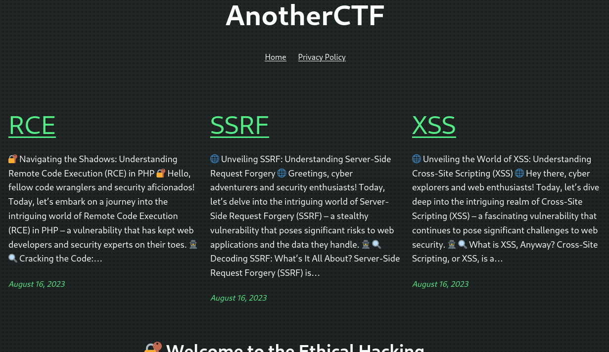

# Write-up: **Smol**
Smol is a medium-ranked CTF box that introduces us to vulnerable Wordpress plugins, highlighting the need for website owners to keep dependencies up-to-date and to consider the source and reputation of installed plugins. The vulnerable web front-end then allows the execution of code on the web server, allowing to obtian a foothold on the system. Ultimately, root access is obtained through a combination of poorly managed passwords and misconfigurations.

## Reconaissance
The first step is to scan the host for open ports and find out about services that are offered. With `nmap`, we scan the 1000 most popular ports.
```
nmap -sV smol.thm
```
As the result shows us, two ports are open, offering the service SSH and a webpage.
```
22/tcp open  ssh     OpenSSH 8.2p1 Ubuntu 4ubuntu0.9 (Ubuntu Linux; protocol 2.0)
80/tcp open  http    Apache httpd 2.4.41 ((Ubuntu))
```

When we try to visit the website, we get redirected to `www.smol.thm`, which is unknown to our domain server. Subsequently, we add the domain to our `/etc/hosts` file, allowing us to open the page.



As we can see on the bottom of the page, the website is powered by the Wordpress framework. Therefore we should definitely run `wpscan` on the blog. Registering on WPScan's [official webpage](https://wpscan.com/) allows you to additionally make use of API tokens, which enables `wpscan` to access the WordPress Vulnerability Database, basically allowing your scan to automatically detect vulnerable plugins and themes. With the free-plan, you get 25 tokens per day.
```
wpscan --url www.smol.thm --api-token WEHKBQUrGbrJWLv7F7yWCJoZkARqtYlh1DDnsZ46n6E
```
Among others, we are able to identify the follwing vulnerability.
```
 | [!] Title: JSmol2WP <= 1.07 - Unauthenticated Server Side Request Forgery (SSRF)
 |     References:
 |      - https://wpscan.com/vulnerability/ad01dad9-12ff-404f-8718-9ebbd67bf611
 |      - https://cve.mitre.org/cgi-bin/cvename.cgi?name=CVE-2018-20463
 |      - https://www.cbiu.cc/2018/12/WordPress%E6%8F%92%E4%BB%B6jsmol2wp%E6%BC%8F%E6%B4%9E/#%E5%8F%8D%E5%B0%84%E6%80%A7XSS
```
Following up the first link, we can see a proof of concept, allegedly allowing us to include files of the server into the rendered webpage.
```
http://localhost:8080/wp-content/plugins/jsmol2wp/php/jsmol.php?isform=true&call=getRawDataFromDatabase&query=php://filter/resource=../../../../wp-config.php
```

## Establish a Foothold
Executing the actual PoC (of course after having exchanged domain and port) already yields an interesting finding, since we can find the credentials of the MySQL user that is being used by Wordpress.
```
...
/** Database username */
define( 'DB_USER', 'wpuser' );

/** Database password */
define( 'DB_PASSWORD', -REDACTED- );
...
```
If the people that set up the server were cautious, they of course didn't reuse these credentials for an actual user of the Wordpress blog. But as Einstein indicated, we all do have not so bright moments, so it's definitely worth to check if we can login with the `wpuser` user. Since the login page is not visible on the home site, one can open the blog article about RCEs and try to comment under it, which redirects to the login. And in fact, we succesfully bypass the first line of security with the credentials that we have found.
